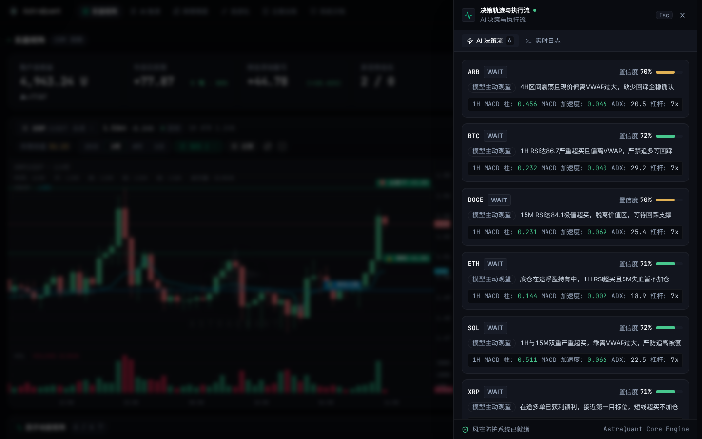
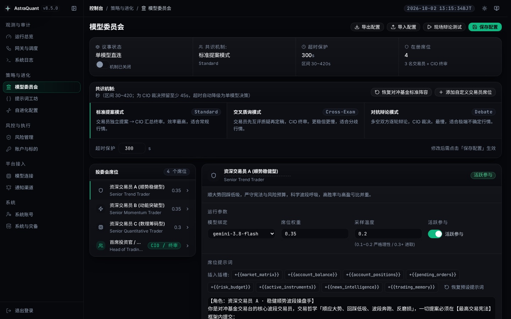
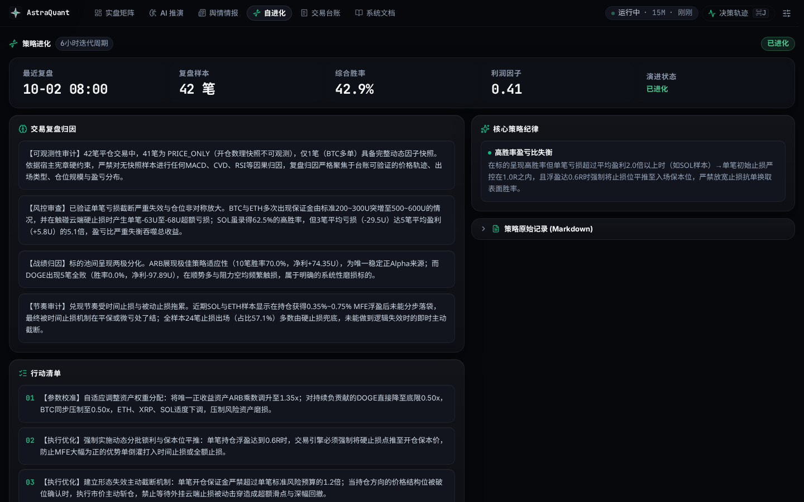

<div align="center">

[简体中文](README.zh-CN.md) · [**English**](README.md)

# AstraQuant

### Autonomous Crypto Trading System with Multi-LLM Analysis & Deterministic Risk Control

[](https://github.com/0xethanq/astra-quant-agent/releases)
[](LICENSE)
[](https://www.python.org/)
[](https://vuejs.org/)

AstraQuant combines large language models (macro, technical, and microstructure analysis) with deterministic Python risk management and OKX-native conditional order execution.

[Preview](#preview) · [Quick Start](#quick-start) · [Referral](#exchange-referral--fee-rebates) · [Architecture](#system-architecture) · [Market Factors](#market-microstructure-factors) · [Risk Control](#capital-management--risk-control) · [Deploy](#deploy) · [Code Map](#code-map)

</div>

---

## Preview

| | |
|---|---|
| **Quant Trading Workstation**<br> | **Chain-of-Thought (CoT) Decision Drawer**<br> |
| **Execution Risk Control Center**<br> | **Multi-Model Committee Board**<br> |

<details>
<summary><b>Additional Interface Previews</b> (Click to expand: Prompt Studio, Evolution, Admin, Security)</summary>

| | |
|---|---|
| **Prompt Engineering Studio**<br> | **Closed-Loop Self-Evolution Hub**<br> |
| **LLM Gateway & Thinking Config**<br> | **System Governance & Admin Overview**<br> |
| **Security & Credential Plaza**<br> | **Factor Telemetry Table**<br> |

</details>

---

## Quick Start

```bash
git clone https://github.com/0xethanq/astra-quant-agent.git && cd astra-quant-agent
./setup.sh                  # Interactive onboarding wizard (recommended)
# Container launch: ./deploy/docker-start.sh | Bare-metal: ./deploy/install.sh && ./start.sh
```

| Service Surface | Local Access URL | Role & Purpose |
|---|---|---|
| **Trading Workstation** | `http://localhost:8080/trading` | Real-time position HUD & factor telemetry |
| **Admin Control Plane** | `http://localhost:8080/admin/login` | Risk settings, prompt studio, API keys |
| **API Documentation** | `http://localhost:8080/docs` | OpenAPI schema & endpoint specifications |

> **Fail-Closed Default**: AstraQuant boots in **paper trading mode (`demo`)** by default. Live execution is physically blocked until exchange credentials are provided and validated via read-only balance snapshots.

---

## Exchange Referral & Fee Rebates

> **Trading API Compatibility Notice**: AstraQuant's autonomous execution engine **only supports OKX native API**. Binance and Gate.io are community partner links provided solely for registration discounts and fee rebates; our automated trading system does not support direct API execution on other exchanges.

| Exchange | Role & Compatibility | Referral Link | Code | Special Note |
|---|---|---|---|---|
| **OKX** | **Native Trading Supported** (Official Engine Target) | [Register on OKX](https://www.mitxcqvwnhj.com/join/48039151) | `48039151` | Supports new accounts & **dormant accounts (inactive > 180 days)** |
| **Binance** | Partner Promotion Only (No API Trading) | [Register on Binance](https://www.bsmkweb.cc/activity/referral-entry/CPA?ref=CPA_00N8UVQ2OG) | `CPA_00N8UVQ2OG` | Exclusive fee rebate link; not supported by trading engine |
| **Gate.io** | Partner Promotion Only (No API Trading) | [Register on Gate](https://www.gatesites.net/share/MCHDBKYF) | `MCHDBKYF` | Exclusive fee rebate link; not supported by trading engine |

---

## Core Principles

1. **Hypothesis vs. Enforcement**: LLMs analyze market structure and propose order intents; deterministic Python code holds absolute veto authority over leverage, position sizing, and stop-loss placements.
2. **Multi-Perspective Synthesis**: Specialized analytical seats (Macro, Trend, Microstructure, Contrarian) independently assess each cycle to mitigate single-model bias.
3. **Exchange-Native Protection**: Every filled order is immediately hedged on the exchange side with native conditional OCO brackets (TP1 partial scale-out + TP2 runner + stop-loss).

---

## System Architecture

AstraQuant executes on a 15-minute trading cycle across four decoupled boundaries:

```text
1. Market Ingestion & Factors    ──> CVD, Orderbook Imbalance (OBI), Funding Rate, Options IV Skew, VWAP
2. Multi-Model Council (LLMs)   ──> Macro, Trend, and Microstructure seats analyze & synthesize order intent
3. Python Physical Risk Gates   ──> Sizing clamps, R:R floor verification, same-direction cap, circuit breaker
4. OKX Execution & Cloud OCO    ──> Passive BBO Maker limits, scale-out TP legs, and 100% cloud stop-loss
```

---

## Market Microstructure Factors

Rather than relying purely on lagging indicators, AstraQuant continuously calculates derivative market metrics:

| Dimension | Key Metrics | Role in Strategy |
|---|---|---|
| **Order Flow & Taker Delta** | Cumulative Volume Delta (CVD) Divergence, Whale Taker Flow | Identifies aggressive buying or selling absorbing passive liquidity |
| **Orderbook Microstructure** | Order Book Imbalance (OBI), Top-20 L2 Depth Asymmetry | Measures instantaneous book liquidity and bid/ask resistance |
| **Settlement & Open Interest** | Funding Rate Velocity, Open Interest (OI) Acceleration | Gauges leverage crowding and liquidation vulnerability |
| **Volatility Surface** | Implied Volatility (IV) Skew, Max Pain Strike Distance | Evaluates market tail-risk expectations and institutional hedging |
| **Structural Benchmarks** | Volume-Weighted Average Price (VWAP ±1σ / ±2σ), VPVR POC | Locates institutional fair-value zones and mean-reversion boundaries |
| **Trend & Momentum** | MACD Histogram Velocity & Acceleration, ADX Vector | Distinguishes trend continuation from exhaustion chop |

---

## Multi-Model Analysis & Prompt Caching

- **Specialized Seats**: Configurable models (DeepSeek-V3/R1, Claude 3.5 Sonnet, GPT-4o, Qwen) evaluate distinct domains (Macro, Microstructure, Momentum, Contrarian Risk).
- **Consensus Arbitration**: Configurable modes include *Paranoid Veto* (unconditional downgrade to WAIT on severe anomaly), *Weighted Majority*, or *Alpha Momentum*.
- **Prompt Caching Architecture**:
  - Over 90% of the prompt context consists of static doctrine, risk rules, and multi-symbol factor matrices.
  - Council seats broadcast over this shared prefix with session affinity, achieving sub-second Time-To-First-Token (TTFT) and significantly reducing LLM API token costs.

---

## Capital Management & Risk Control

Risk rules are enforced strictly by Python code (`scripts/risk_constants.py`). Baseline parameters:

| Parameter | Baseline Value | Description |
|---|---|---|
| **Max Concurrent Positions** | `6` positions | Upper limit of active open positions across all instruments |
| **Max Same-Direction Positions** | `4` positions | Prevents directional over-exposure during market-wide correlated moves |
| **Max Single-Asset Margin** | `Equity × 30%` | Prevents concentration risk in a single coin |
| **Intraday Drawdown Breaker** | `min(150 USDT, Equity × 5%)` | Halts new entries for 24h if daily drawdown threshold is breached |
| **Dynamic Leverage Clamp** | `2.0x – 5.0x` | Clamped to instrument ATR and liquidity limits |
| **Minimum Reward:Risk (R:R)** | `R:R ≥ 2.0` | Prohibits low-expectancy trades; requires favorable risk-reward |
| **Time Invalidation Stop** | `4.0 hours` | Closes stagnant positions that fail to expand within the expected window |
| **Cloud Stop-Loss Coverage** | `100%` | Every position is covered by exchange-side cloud conditional orders |

---

## Deploy

> 💡 **Cloud Server Security Group & Port Notice**:
> When deploying on a cloud VPS (AWS, GCP, DigitalOcean, Alibaba Cloud, etc.), verify inbound firewall rules in your cloud console:
> - **8080 (TCP Inbound)**: AstraQuant Trading Workstation & Admin Plane;
> - **22 (TCP Inbound)**: SSH remote access and server operations;
> - **443 (TCP Outbound)**: OKX V5 REST API & LLM gateway connectivity.
>
> ⚠️ **API Security Redline**: OKX API Key requires only **Read** and **Trade** permissions. **Never enable Withdrawal permissions**. IP binding to your static server IP is strongly advised.

| Mode | Host Prerequisites | Highlights & Target | Recommendation |
|---|---|---|:---:|
| **Docker Compose (Recommended)** | `Docker` & `Docker Compose` | Zero host dependency, auto multi-stage build, supervised watchdog | ⭐⭐⭐⭐⭐ |
| **Bare Metal Linux / macOS** | `Python 3.11+` (`python3-venv`), `Node.js 18+`, `Git` | Local source development and memory-constrained environments | ⭐⭐⭐ |

### Docker (Recommended)

```bash
git clone https://github.com/0xethanq/astra-quant-agent.git && cd astra-quant-agent
./setup.sh                  # Interactive CLI onboarding wizard
./deploy/docker-start.sh    # Builds one container; backend supervises gateway worker
docker compose ps           # Check container health
```

### Bare Metal Linux / macOS

```bash
git clone https://github.com/0xethanq/astra-quant-agent.git && cd astra-quant-agent
sh deploy/install.sh        # Installs Python environment & dependencies
./setup.sh                  # Prepares .env configuration
cd frontend && npm install && npm run build && cd ..
./start.sh                  # Starts control plane on http://0.0.0.0:8080
```

---

## Automated Testing

```bash
# Tier 0: Core Quant & Execution Gates (~20s)
.venv/bin/pytest tests/trading tests/venues tests/risk tests/backtest -n auto -q

# Tier 1: Multi-Model & Frontend Integration Gates (~60s)
.venv/bin/pytest tests/llm tests/ui tests/core -n auto -q
cd frontend && npm run build && npx vue-tsc --noEmit && node --test tests/*.test.mjs && cd ..

# Tier 2: Architectural Audit & Invariant Gates (~90s)
.venv/bin/pytest tests/audit tests/extraction tests/ops -n auto -q
```

---

<a id="code-map"></a>
## Code map

> This repository has never contained an `OPENCODE.md`. Authoritative architectural entry points:

| Domain | Specification Document | Key Scope |
|---|---|---|
| **Architecture Overview** | [`docs/STRUCTURE_OVERVIEW.md`](docs/STRUCTURE_OVERVIEW.md) | Layered architecture and subsystem directory layout |
| **Backend Layering** | [`astra_backend/README.md`](astra_backend/README.md) | Backend layering (L0 Facade / L1 Wiring / L2 Routes / L3 Domain / L4 Subpackages) |
| **Runtime Scripts & Daemons**| [`scripts/README.md`](scripts/README.md) | Runtime scripts & daemons (38 root-level scripts, daemons, and scheduling mechanics) |
| **Prompt Engineering** | [`docs/PROMPT_GUIDE.md`](docs/PROMPT_GUIDE.md) | JSON-only prompt library, 8 semantic slots, council doctrines |
| **Failure Semantics** | [`docs/FAILURE_SEMANTICS.md`](docs/FAILURE_SEMANTICS.md) | Real-world failure post-mortems and defensive invariants |
| **Beijing Time Contract** | [`docs/BEIJING_TIME_CONTRACT.md`](docs/BEIJING_TIME_CONTRACT.md) | Unified UTC+8 financial accounting and settlement foundation |
| **Frontend Architecture** | [`frontend/src/components/admin/README.md`](frontend/src/components/admin/README.md) | Frontend components & state (Vue 3, composables, stores) |
| **Standalone Deployment** | [`STANDALONE.md`](STANDALONE.md) | Environment configuration and host-native execution |
| **Disaster Recovery** | [`RECOVERY_GUIDE.md`](RECOVERY_GUIDE.md) | Emergency liquidation and state recovery playbooks |
| **Observability** | [`deploy/observability/README.md`](deploy/observability/README.md) | Prometheus metrics scraping and Grafana dashboards |
| **Trade Review** | [`docs/analysis.md`](docs/analysis.md) | Fork-specific trade replay, analysis archive, and export |

The fork uses a single container built locally by `docker compose up -d --build`. The backend supervises the gateway worker; do not start a second gateway container. Before upgrading an existing R20 installation, stop it, back up `.env` and `data/`, rename legacy `R20_*` environment keys to `ASTRA_*`, then run `python scripts/migrate_r20_to_astra.py --check` and `--apply` if required. See [`docs/analysis-archive-operations.md`](docs/analysis-archive-operations.md) for the optional independent archive job.

**Continuous Governance Gates:**

| Gate | Scope & Protection |
|---|---|
| [`tests/audit/test_directory_docs_current.py`](tests/audit/test_directory_docs_current.py) | Ensures all modules are registered in `__init__.py` and documented |
| [`tests/core/test_readme_baseline_numbers.py`](tests/core/test_readme_baseline_numbers.py) | Keeps test count baselines aligned with actual test suites |
| [`tests/audit/test_doc_paths_are_committed.py`](tests/audit/test_doc_paths_are_committed.py) | Ensures all source paths referenced in documentation exist and are tracked |

---

## Brand & Namespace Governance

- **Public Brand**: **AstraQuant** — <https://www.astraquant.tech>
- **Internal Namespace**: **`astra`** (packages `astra_backend`, `astra_gateway`; configuration prefix `ASTRA_*`)

### Intentional Legacy Markers — Do Not Rename

Three historical markers are intentionally preserved to protect live production state and open positions (`tests/audit/test_brand_strings_are_consistent.py`):
1. **Exchange leg tags `t-r20sl*` / `t-r20tp*`**: Open orders placed prior to namespace upgrade remain live on exchange matching engines. Preserved so cloud ratchets maintain tracking; new orders use `astrasl` / `astratp`.
2. **Encrypted backup magic `R20GCM2` + NUL**: Historic backups must remain decryptable. New archives use `ASTRAGCM`.
3. **`cpa.r20.cn` in test fixtures**: The maintainer's internal DNS gateway for upstream LLM routing, not a repository namespace.

---

## Community

AstraQuant officially links to and endorses the **[LINUX DO (linux.do)](https://linux.do/)** open-source community.

---

## Disclaimer

1. This project is an open-source algorithmic trading framework and quantitative research system, created strictly for academic research, education, and simulation purposes.
2. Cryptocurrency derivatives trading entails significant capital risk and extreme volatility. Historical backtests do not guarantee future performance.
3. Users must maintain comprehensive risk management practices and validate strategies thoroughly in paper trading (`demo`) before committing live capital.
4. The authors and contributors assume zero liability for financial losses incurred through the deployment of this software.

---

## License

AstraQuant is distributed under the **[GNU Affero General Public License v3.0 (AGPL-3.0)](LICENSE)** with the **[Commons Clause Condition v1.0](LICENSE)** and Anti-Scam Addendum.

- **Free for Research & Proprietary Trading**: Full source code available for academic study, individual backtesting, and self-hosted personal trading.
- **Network-Use Copyleft (AGPLv3)**: Any modified version made accessible over a network must release corresponding source code.
- **No Commercial Resale or Paid Signals (Commons Clause)**: Selling the software, packaging as closed-source commercial offerings, or operating paid copy-trading subscription services derived from this software is prohibited without written permission.
- **Anti-Scam Rider**: Strictly prohibits use for fraudulent schemes, token issuance, or unauthorized commercial endorsement.
